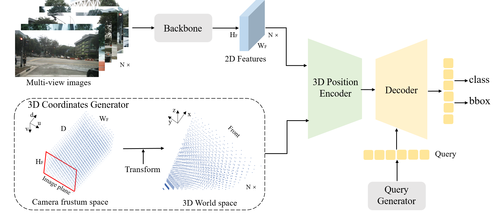
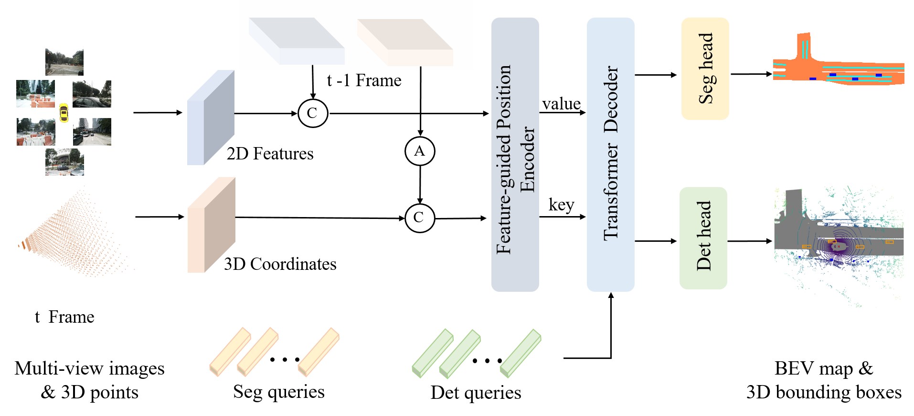

# Position Embedding Transformation for Multi-View 3D Object Detection
[](https://arxiv.org/abs/2203.05625)

<!-- ## Introduction -->

This repository is an official implementation of [PETR](https://arxiv.org/abs/2203.05625) and [PETRv2](https://arxiv.org/abs/2206.01256) 

<div align="center">
  
</div><br/>

PETR develops position embedding transformation
(PETR) for multi-view 3D object detection. PETR encodes the position
information of 3D coordinates into image features, producing the
3D position-aware features. Object query can perceive the 3D position-aware features and perform end-to-end object detection. It can serve as a simple yet strong baseline for future research.  

<div align="center">
  
</div><br/>

PETRv2 is a unified framework for 3D perception from multi-view images. Based on PETR, PETRv2 explores the effectiveness of temporal modeling, which utilizes the temporal information of previous frames to boost 3D object detection. The 3D PE achieves the temporal alignment on object position of different frames. A feature-guided position encoder is further introduced to improve the data adaptability of 3D PE. To support for high-quality BEV segmentation, PETRv2 provides a simply yet effective solution by adding a set of segmentation queries. Each segmentation query is responsible for segmenting one specific patch of BEV map. PETRv2 achieves state-of-the-art performance on 3D object detection and BEV segmentation. 

## News
**2022.07.04** PETR has been accepted by ECCV 2022.  
**2022.06.28** The code of BEV Segmentation in PETRv2 is released.  
**2022.06.16** The code of 3D object detection in PETRv2 is released.  
**2022.06.10** The code of PETR is released.  
**2022.06.06** PETRv2 is released on [arxiv](https://arxiv.org/abs/2206.01256).  
**2022.06.01** PETRv2 achieves another SOTA performance on nuScenes dataset **(58.2% NDS and 49.0% mAP)** by the temporal modeling and supports BEV segmentation.  
**2022.03.10** PETR is released on [arxiv](https://arxiv.org/abs/2203.05625).  
**2022.03.08** PETR achieves SOTA performance **(50.4% NDS and 44.1% mAP)** on standard nuScenes dataset.

## Preparation
This implementation is built upon [detr3d](https://github.com/WangYueFt/detr3d/blob/main/README.md), and can be constructed as the [install.md](./install.md).

* Environments  
  Linux, Python==3.6.8, CUDA == 11.2, pytorch == 1.9.0, mmdet3d == 0.17.1   

* Detection Data   
Follow the mmdet3d to process the nuScenes dataset (https://github.com/open-mmlab/mmdetection3d/blob/master/docs/en/data_preparation.md).

* Segmentation Data  
Download Map expansion from nuScenes dataset (https://www.nuscenes.org/nuscenes#download). Extract the contents (folders basemap, expansion and prediction) to your nuScenes `maps` folder.  
Then build Segmentation dataset:
  ```
  cd tools
  python build-dataset.py
  ```
  
  If you want to train the segmentation task immediately, we privided the processed data ( HDmaps.tar ) at [gdrive](https://drive.google.com/file/d/1hr1NN3n6FWLLG5mjngk_yjMXpyv44oEo/view?usp=sharing) and [Baidu Netdisk](https://pan.baidu.com/s/1kF4i7os_4LEHbCVsn4WWww). The processed info files of segmentation can also be find at [gdrive](https://drive.google.com/drive/folders/1_C2yuh51ROF3UzId4L1itwGQVUeVUxU6?usp=sharing) and [Baidu Netdisk](https://pan.baidu.com/s/19Tr08kXoxmaElasiF_QShg). The code of Baidu Netdisk is `petr`.


* Pretrained weights   
To verify the performance on the val set, we provide the pretrained V2-99 [weights](https://drive.google.com/file/d/1ABI5BoQCkCkP4B0pO5KBJ3Ni0tei0gZi/view?usp=sharing). The V2-99 is pretrained on DDAD15M ([weights](https://tri-ml-public.s3.amazonaws.com/github/dd3d/pretrained/depth_pretrained_v99-3jlw0p36-20210423_010520-model_final-remapped.pth)) and further trained on nuScenes **train set** with FCOS3D.  For the results on test set in the paper, we use the DD3D pretrained [weights](https://drive.google.com/drive/folders/1h5bDg7Oh9hKvkFL-dRhu5-ahrEp2lRNN). The ImageNet pretrained weights of other backbone can be found [here](https://github.com/open-mmlab/mmcv/blob/master/mmcv/model_zoo/open_mmlab.json).
Please put the pretrained weights into ./ckpts/. 

* After preparation, you will be able to see the following directory structure:  
  ```
  PETR
  ├── mmdetection3d
  ├── projects
  │   ├── configs
  │   ├── mmdet3d_plugin
  ├── tools
  ├── data
  │   ├── nuscenes
  │     ├── HDmaps-nocover
  │     ├── ...
  ├── ckpts
  ├── README.md
  ```

## Train & inference
<!-- ```bash
git clone https://github.com/megvii-research/PETR.git
``` -->
```bash
cd PETR
```
You can train the model following:
```bash
tools/dist_train.sh projects/configs/petr/petr_r50dcn_gridmask_p4.py 8 --work-dir work_dirs/petr_r50dcn_gridmask_p4/
```
You can evaluate the model following:
```bash
tools/dist_test.sh projects/configs/petr/petr_r50dcn_gridmask_p4.py work_dirs/petr_r50dcn_gridmask_p4/latest.pth 8 --eval bbox
```
## Visualize
You can generate the reault json following:
```bash
./tools/dist_test.sh projects/configs/petr/petr_vovnet_gridmask_p4_800x320.py work_dirs/petr_vovnet_gridmask_p4_800x320/latest.pth 8 --out work_dirs/pp-nus/results_eval.pkl --format-only --eval-options 'jsonfile_prefix=work_dirs/pp-nus/results_eval'
```
You can visualize the 3D object detection following:
```bash
python3 tools/visualize.py
```

## Main Results
PETR: We provide some results on nuScenes **val set** with pretrained models. These model are trained on 8x 2080ti **without cbgs**. Note that the models and logs are also available at [Baidu Netdisk](https://pan.baidu.com/s/1-JkzOxKy4isMiiNHd20Z-w) with code `petr`.

| config            | mAP      | NDS     |training    |   config |   download |
|:--------:|:----------:|:---------:|:--------:|:--------:|:-------------:|
| PETR-r50-c5-1408x512   | 30.5%     | 35.0%    | 18hours  | [config](projects/configs/petr/petr_r50dcn_gridmask_c5.py)  |   [log](https://drive.google.com/file/d/1pXT6JltfMF0PAyG17zVcoXLJEYMKVWQr/view?usp=sharing) / [gdrive](https://drive.google.com/file/d/1c5rgTpHA98dFKmQ9BJN0zZbSuBFT8_Bt/view?usp=sharing)     |
| PETR-r50-p4-1408x512 | 31.70%     | 36.7%    | 21hours   | [config](projects/configs/petr/petr_r50dcn_gridmask_p4.py)   |   [log](https://drive.google.com/file/d/1Knoid2-ZiQhl1lcTt65SROTZiuvfTGT7/view?usp=sharing) / [gdrive](https://drive.google.com/file/d/1eYymeIbS0ecHhQcB8XAFazFxLPm3wIHY/view?usp=sharing)    
| PETR-vov-p4-800x320   | 37.8%     | 42.6%    | 17hours  | [config](projects/configs/petr/petr_vovnet_gridmask_p4_800x320.py)   |   [log](https://drive.google.com/file/d/1eG914jDVK3YXvbubR8VUjP2NnzYpDvHC/view?usp=sharing) / [gdrive](https://drive.google.com/file/d/1-afU8MhAf92dneOIbhoVxl_b72IAWOEJ/view?usp=sharing)        |
| PETR-vov-p4-1600x640 | 40.40%     | 45.5%    | 36hours   | [config](projects/configs/petr/petr_vovnet_gridmask_p4_1600x640.py)   |   [log](https://drive.google.com/file/d/1XfO5fb_Nd6jhQ3foBUG7WCz0SlTlBKu8/view?usp=sharing) / [gdrive](https://drive.google.com/file/d/1SV0_n0PhIraEXHJ1jIdMu3iMg9YZsm8c/view?usp=sharing)  

PETRv2: We provide a 3D object detection baseline and a BEV segmentation baseline with two frames. The model is trained on 8x 2080ti **without cbgs**. The processed [info files](https://drive.google.com/drive/folders/1_C2yuh51ROF3UzId4L1itwGQVUeVUxU6?usp=sharing) contain 30 previous frames, whose transformation matrix is aligned with the current frame.  The info files, models and logs are also available at [Baidu Netdisk](https://pan.baidu.com/s/10IaWAq1mljX5ztLzQT_4Kg) with code `petr`.
| config            | mAP      | NDS     |training    |   config |   download |
|:--------:|:----------:|:---------:|:--------:|:--------:|:-------------:|
| PETRv2-vov-p4-800x320   | 41.0%     | 50.3%    | 30hours  | [config](projects/configs/petrv2/petrv2_vovnet_gridmask_p4_800x320.py)  | [log](https://drive.google.com/file/d/1QcVSDHoUAcFLqziwZrBn5A2oAjH86WiO/view?usp=sharing) / [gdrive](https://drive.google.com/file/d/1tv_D8Ahp9tz5n4pFp4a64k-IrUZPu5Im/view?usp=sharing)    

Thanks to @evakasch for reminding us, we find a bug in the metric. Therefore, this result is not accurate and we will fix it as soon as possible.
| config            | Drive      | Lane   |  Vehicle     |training    |   config |download  |
|:--------:|:----------:|:---------:|:--------:|:--------:|:--------:|:-------------:|
| PETRv2_BEVseg   | 79.1%     | 44.7%   | 49.9%     | 30hours  | [config](projects/configs/petrv2/PETRv2_BEVseg.py)  | [log](https://drive.google.com/file/d/1PkAWcCag6ElsvF3PNoRNrEdeo39epVso/view?usp=sharing) / [gdrive](https://drive.google.com/file/d/1MP5a3C4Bj43uG_ao3P1RNF-xIvHkBUY7/view?usp=sharing)   


## Acknowledgement
Many thanks to the authors of [mmdetection3d](https://github.com/open-mmlab/mmdetection3d) and [detr3d](https://github.com/WangYueFt/detr3d) .


## Citation
If you find this project useful for your research, please consider citing: 
```bibtex   
@article{liu2022petr,
  title={Petr: Position embedding transformation for multi-view 3d object detection},
  author={Liu, Yingfei and Wang, Tiancai and Zhang, Xiangyu and Sun, Jian},
  journal={arXiv preprint arXiv:2203.05625},
  year={2022}
}
```
```bibtex   
@article{liu2022petrv2,
  title={PETRv2: A Unified Framework for 3D Perception from Multi-Camera Images},
  author={Liu, Yingfei and Yan, Junjie and Jia, Fan and Li, Shuailin and Gao, Qi and Wang, Tiancai and Zhang, Xiangyu and Sun, Jian},
  journal={arXiv preprint arXiv:2206.01256},
  year={2022}
}
```
## Contact
If you have any questions, feel free to open an issue or contact us at liuyingfei@megvii.com, yanjunjie@megvii.com or wangtiancai@megvii.com.
